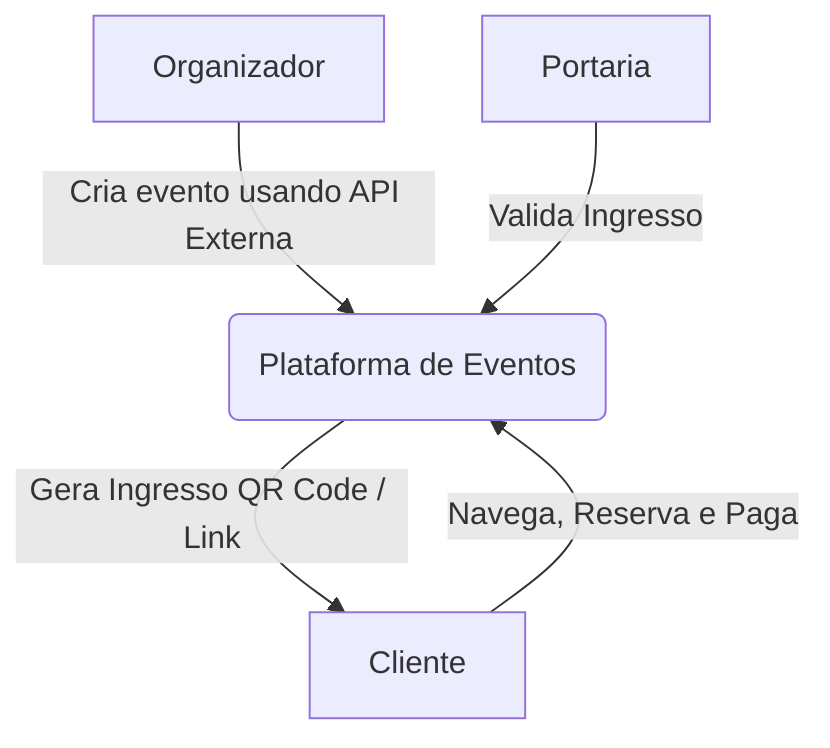

# Desafio Elite Dev - Verzel

Este documento detalha o escopo e as diretrizes do desafio técnico para a vaga de **Desenvolvedor(a) Fullstack/Frontend Júnior**, com base no documento oficial do projeto ([scopo-do-desafio.jpg](file:///c:/Users/vinia/projects/event-challenge/assets/scopo-do-desafio.jpg)).

---

## 🎯 Objetivo do Teste

Validar conhecimentos técnicos em desenvolvimento **Front-End** e **Back-End**, lógica de programação, e a capacidade de compreender e atender à demanda proposta de forma consultiva e deliberada.

---

## 💡 A Proposta de Solução

O objetivo é criar uma **Plataforma de Eventos e Ingressos** contendo três fluxos ou papéis principais:

### 1. 🧑‍💼 O Organizador

- Monta um evento a partir de um catálogo de shows ou filmes obtido de uma **API externa**.
- Define as informações do evento:
  - Data e local.
  - Capacidade total de público.
  - Preço do ingresso.

### 2. 👤 O Cliente

- Navega pela lista de eventos publicados.
- Reserva seu lugar no evento.
- Realiza o pagamento simulado do ingresso.
- Recebe o ingresso gerado com um **QR Code**.
- Pode compartilhar o ingresso gerado através de um link.

### 3. 🚪 A Portaria

- Valida o ingresso na entrada do evento para controle de acesso.

---

## 🧠 Filosofia de Avaliação: "O que queremos ver"

O projeto possui um escopo intencionalmente reduzido para focar na qualidade e no processo de tomada de decisão do candidato.

### 🚫 Fuja do "AI Slop"

- **O que é AI Slop?** Interfaces genéricas criadas por ferramentas de Inteligência Artificial sem nenhuma personalização ou pensamento de design (a famosa "cara de template pronto").
- O uso de IA não é proibido, mas o resultado final deve demonstrar escolhas conscientes do desenvolvedor.

### 🔍 Critérios de Avaliação

- **Como você pensa:** Quais decisões arquiteturais e de design foram tomadas e quais caminhos foram descartados.
- **Autoralidade:** A sua identidade e capricho impressos no código e no visual da aplicação.
- **UX/UI Deliberada:** Por que as telas são organizadas de determinada forma e como isso melhora a experiência de quem usa.
